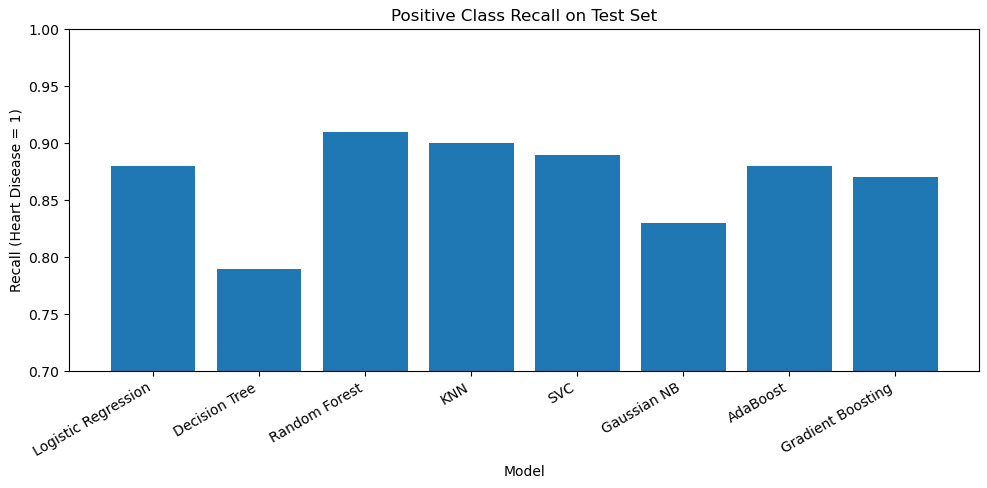

# Heart Disease Predictor

## Problem Statement
Heart disease is the leading cause of death worldwide. The goal of this project is to build a machine learning pipeline that can accurately identify patients with heart disease.

## About Dataset
- Featured 920 rows of patient data
- Included a mixture of numerical and categorical features
- Balanced target class

## Evaluation Metric
Recall was selected as the primary evaluation metric because failing to identify a patient with heart disease (false negative) poses a higher risk than incorrectly flagging a healthy patient (false positive).

## Pipeline Overview
The modeling pipeline includes:
- Train-test split with stratification
- Separate preprocessing pipelines for numerical and categorical features
- Median imputation and standard scaling for numerical features
- Mode imputation and one-hot encoding for categorical features
- GridSearchCV for hyperparameter tuning on the cross-validation set
- Model training and evaluation using recall on the test set

## Feature Selection
Several features were excluded to improve generalizability and reduce bias:
- An engineered feature `max_hr_gap` was removed due to no measurable improvement in cross-validation performance.
- The `dataset` feature was excluded to avoid introducing location-specific bias.
- The `ca` and `thal` features were removed because more than 50% of their values were missing, which would bias the model toward imputed values.

## Model Performance

The Random Forest model achieved the highest Recall of **91%** on the positive class, making it the most effective at identifying patients with heart disease.
